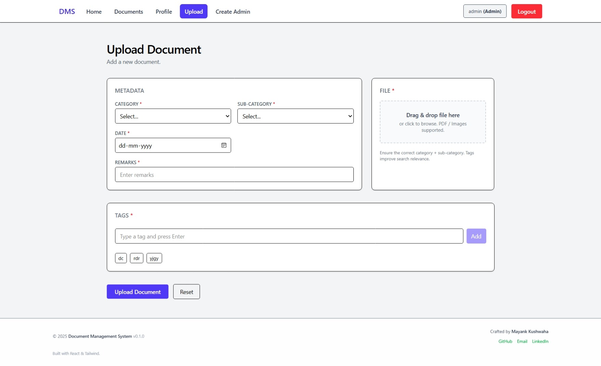

# 📁 Document Management System (DMS)

Full‑stack application for secure storage, classification, search, and retrieval of documents.

### **Backend**


### **Frontend**


### Scroll below for Setup Instruction

---

## 🚀 Overview

This Document Management System lets organizations upload, categorize, tag, and search documents by **Category**, **Sub-Category**, **Date**, and **Tags**. It supports role‑based access with an **Admin** policy enforced via JWT claims (`isAdmin=true`). Files are stored on disk and metadata in MySQL.

## ✨ Key Features

- User authentication (JWT) with admin claim policy
- Document upload (PDF, Images, etc.) with metadata + tags
- Full document listing & filtered search (date range, category, tags)
- Tag auto‑creation during upload
- Static serving of uploaded files via `/wwwroot/uploads`
- Modular service layer (`AuthService`, `FileService`)
- API documentation via Swagger (Development only)

## 🧱 Architecture

```
flowchart LR
	subgraph Client[Frontend (React / TS)]
		UI[Pages + Components]
		Store[Redux Toolkit]
		Http[Axios API Layer]
	end

	subgraph Server[ASP.NET Core 8 API]
		Controllers[Controllers\nAuth / Documents / Heads / Admin]
		Services[Services\nAuthService / FileService]
		DBLayer[Dapper + AppDbContext]
		Jwt[JWT Auth + Policy]
	end

	subgraph Storage[Persistence]
		MySQL[(MySQL DB)]
		Files[/Uploads Folder/]
	end

	UI -->|REST + JWT| Controllers
	Controllers --> Services --> DBLayer --> MySQL
	Controllers --> Files
	Jwt --> Controllers
```

## 🗂 Directory Structure (Simplified)

```
Backend/
	Program.cs            # App bootstrap, DI, Auth, Swagger
	Data/AppDbContext.cs  # Dapper connection + schema + queries + seeding
	Controllers/          # API endpoints
	Services/             # Business logic (Auth, File handling)
	Models/               # POCOs (User, Document, etc.)
	Helpers/              # JWT token helper
	wwwroot/uploads/      # Stored files

Frontend/
	src/
		api/                # Axios clients (auth, documents, heads...)
		pages/              # Route pages (Login, Home, Create Admin ...)
		components/         # Shared layout & route guards
		store/              # Redux store setup
		models/             # TypeScript types
		utils/              # Helpers (future)
	public/
	index.html
	vite.config.ts
```

## 🛠 Tech Stack

| Layer        | Technology               | Notes                                      |
| ------------ | ------------------------ | ------------------------------------------ |
| Backend      | ASP.NET Core 8           | Web API, DI, Middleware                    |
| Data Access  | Dapper                   | Lightweight micro‑ORM                      |
| Database     | MySQL                    | Auto‑creates `mydmsdb` if missing          |
| Auth         | JWT Bearer               | Policy: `AdminOnly` (claim `isAdmin=true`) |
| Passwords    | BCrypt                   | Secure hashing                             |
| File Storage | Disk (`wwwroot/uploads`) | Served as static files                     |
| Frontend     | React 19 + TypeScript    | SPA UI                                     |
| State        | Redux Toolkit            | Centralized auth & data state              |
| Build Tool   | Vite                     | Fast dev server / bundler                  |
| Styling      | Tailwind CSS             | Utility‑first styling                      |
| HTTP         | Axios                    | API client abstraction                     |

## 🔐 Authentication & Authorization

1. User logs in (mobile + password) -> receives JWT.
2. Token includes claims: `sub`, `mobile`, `username`, `isAdmin`.
3. Admin routes require policy `AdminOnly` (enforces `isAdmin=true`).
4. Client stores token and sends via `Authorization: Bearer <token>`.

## 🧪 Seeding Behavior

`AppDbContext` on startup:

- Ensures database + tables exist
- Reads `DBinit` section in configuration (`appsettings.json` / env)
- Inserts Category / Sub-Category if missing
- Creates Admin(s) & User(s) (passwords hashed)

## ⚙️ Configuration

Provide values in `Backend/appsettings.Development.json` (or environment variables):

```jsonc
{
  "DBinit": {
    "Admins": [
      { "mobile": "9993339996", "username": "admin", "password": "admin" }
    ],
    "User": [
      { "mobile": "1234567890", "username": "john", "password": "john" },
      { "mobile": "5554445555", "username": "tom", "password": "tom" },
      { "mobile": "9996669999", "username": "emily", "password": "emily" }
    ],
    "Majors": [
      { "Name": "Personal", "Minors": [] },
      { "Name": "Professional", "Minors": ["Accounts", "HR", "IT", "Finance"] }
    ]
  },
  "ConnectionStrings": {
    "Default": "Server=localhost;User=root;Password=root;Database=mydmsdb;",
    "Master": "Server=localhost;Uid=root;Pwd=root;"
  },
  "Jwt": {
    "Key": "xPBfC2YqcfQ0uiGE2hrKAkUzR4C5PfSqcnzitO9LdhywHh8pWj",
    "Issuer": "DMSAPI",
    "Audience": "DMSClient",
    "ExpiryMinutes": 1440
  },
  "FileStorage": {
    "UploadsPath": "uploads",
    "MaxFileSizeMB": 10
  }
}
```

&nbsp;

&nbsp;

&nbsp;

# 🧩 First-Time Setup

### Prerequisites

- .NET 8 SDK
- Node.js 20+
- MySQL 8.x running locally (user with rights to create DB)

### 1. Clone

```bash
git clone https://github.com/mayankleo/Document-Management-System
cd Document-Management-System
```

### 2. Backend Setup

```powershell
cd Backend
dotnet restore
dotnet build
dotnet run
```

Backend will:

- Create DB `mydmsdb` if missing
- Run table creation
- Seed data (if configured)
- Expose Swagger at http://localhost:7097/swagger (port may vary)

### 3. Frontend Setup

```powershell
cd ../Frontend
npm install
npm run dev
```

Visit: http://localhost:5173

### 4. Login

- Use default admin credentials `9993339996` as admin mobile number (as mentioned in backend/appsettings.json)
- Create additional admins via Admin UI endpoint

## ▶️ Running (Subsequent)

```powershell
cd Backend; dotnet run
# new terminal
cd Frontend; npm run dev
```

## 📁 File Upload Notes

- Files saved with GUID names in `backend/wwwroot/uploads` preserving original name in DB.
- `ContentType`, size, and relationships stored in `Documents` table.
- Tags linked through `DocumentTags` join table.

## 🧹 Cleanup / Maintenance

- To reset DB: drop `mydmsdb` and restart app (will recreate + reseed).
- To clear uploads: delete files in `Backend/wwwroot/uploads` not folder! (ensure DB document rows also removed to avoid broken references).

## 🐞 Common Issues

| Issue               | Cause                   | Fix                                       |
| ------------------- | ----------------------- | ----------------------------------------- |
| 401 Unauthorized    | Missing/expired JWT     | Re-login, include Authorization header    |
| DB connect failure  | Wrong connection string | Update `appsettings.*` or env vars        |
| Admin policy denied | `isAdmin` claim false   | Use admin credentials / seed admin        |
| CORS error          | Origin mismatch         | Match frontend origin in `DevCors` policy |

## 📸 Screenshots



